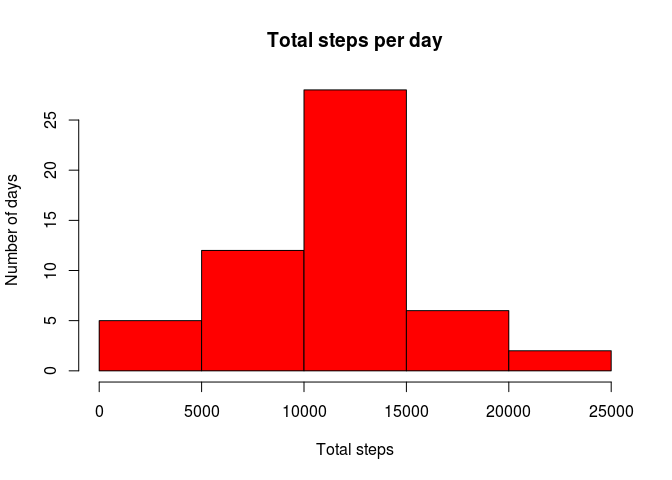
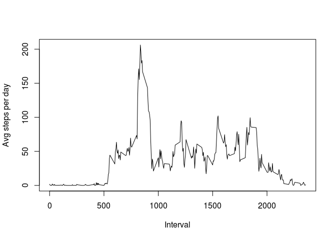
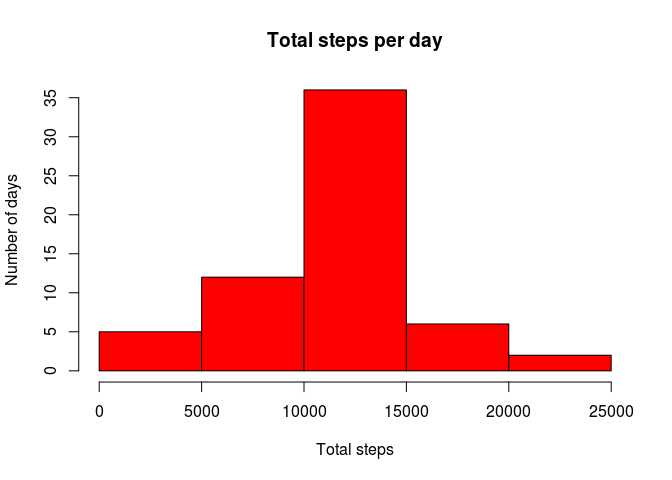

# Reproducible Research: Peer Assessment 1


## Loading and preprocessing the data


```r
library(dplyr)
```

```
## 
## Attaching package: 'dplyr'
## 
## The following objects are masked from 'package:stats':
## 
##     filter, lag
## 
## The following objects are masked from 'package:base':
## 
##     intersect, setdiff, setequal, union
```

```r
library(lattice)
data <- read.csv("./activity.csv",sep = ",")
```


## What is mean total number of steps taken per day?

```r
stepsDay<- data %>%
  group_by(date) %>%
  summarize(total = sum(steps)
  ) 
hist(stepsDay$total,main="Total steps per day",
     xlab="Total steps",ylab="Number of days",col="red")
```

 

```r
meanDay<- mean(stepsDay$total, na.rm=TRUE)
medianDay<- median(stepsDay$total, na.rm=TRUE)
```
The mean of the total number of steps taken per day is : 1.0766189\times 10^{4}
The median of the total number of steps taken per day is : 10765

## What is the average daily activity pattern?

```r
stepsInterval<- data %>%
  group_by(interval) %>%
  summarize(total = mean(steps, na.rm=TRUE)
  )
with(stepsInterval, plot(interval,total,type="l", xlab="Interval",ylab="Avg steps per day"))
```

 

```r
maxStepsInterval<- stepsInterval[which.max(stepsInterval$total),]$interval
```
The 835 interval contains the maximum number of steps

## Imputing missing values

```r
naValues<-sum(is.na(data$steps))

## the nas are only in steps
na_vector<-is.na(data$steps)
data$id = seq_len(nrow(data))
mdata <- merge(data, stepsInterval, by = "interval")
mdata<-arrange(mdata, id)
mdata$steps[na_vector] <- mdata$total[na_vector]

stepsDay<- mdata %>%
  group_by(date) %>%
  summarize(total = sum(steps)
  ) 
hist(stepsDay$total,main="Total steps per day",
     xlab="Total steps",ylab="Number of days",col="red")
```

 

```r
meanDay2<- mean(stepsDay$total, na.rm=TRUE)

medianDay2<- median(stepsDay$total, na.rm=TRUE)
```
Do these values differ from the estimates from the first part of the assignment?
Yes in the case of the median.
The mean was 1.0766189\times 10^{4} and now 1.0766189\times 10^{4}
The median was 10765 and now 1.0766189\times 10^{4}

What is the impact of imputing missing data on the estimates of the total daily number of steps? Alters the median value

## Are there differences in activity patterns between weekdays and weekends?

```r
mdata$day <- factor(ifelse(weekdays(as.Date(mdata$date)) == "sábado" | 
       weekdays(as.Date(mdata$date)) == "domingo", "weekend", "weekday"))

stepsDay <- aggregate(steps ~ interval + day, data = mdata, mean)
names(stepsDay) <- c("interval", "day", "steps")

xyplot(stepsDay$steps ~ stepsDay$interval | stepsDay$day, stepsDay, 
       type = "l", layout = c(1, 2), xlab = "Interval", ylab = "Number of steps")
```

 
